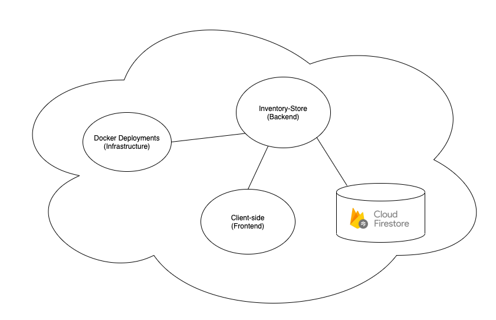
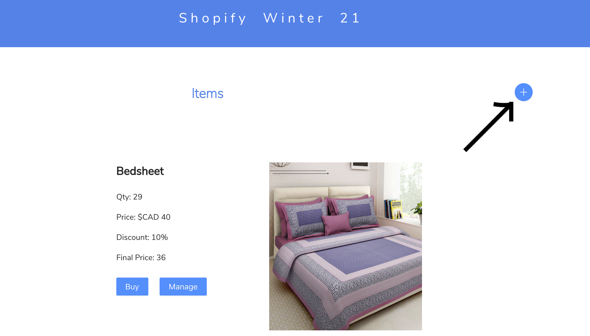
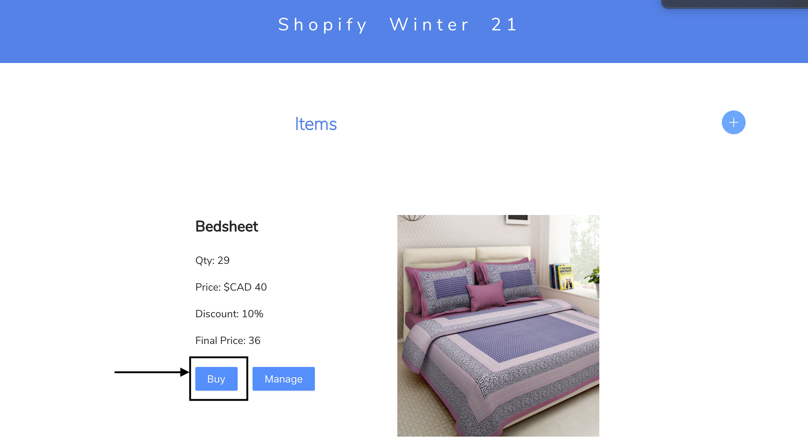
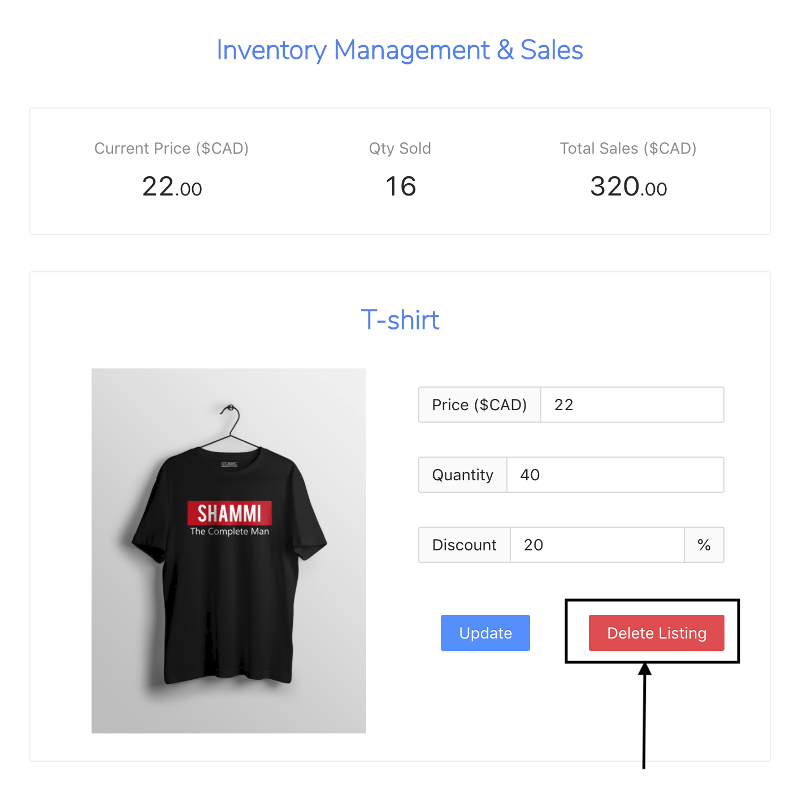
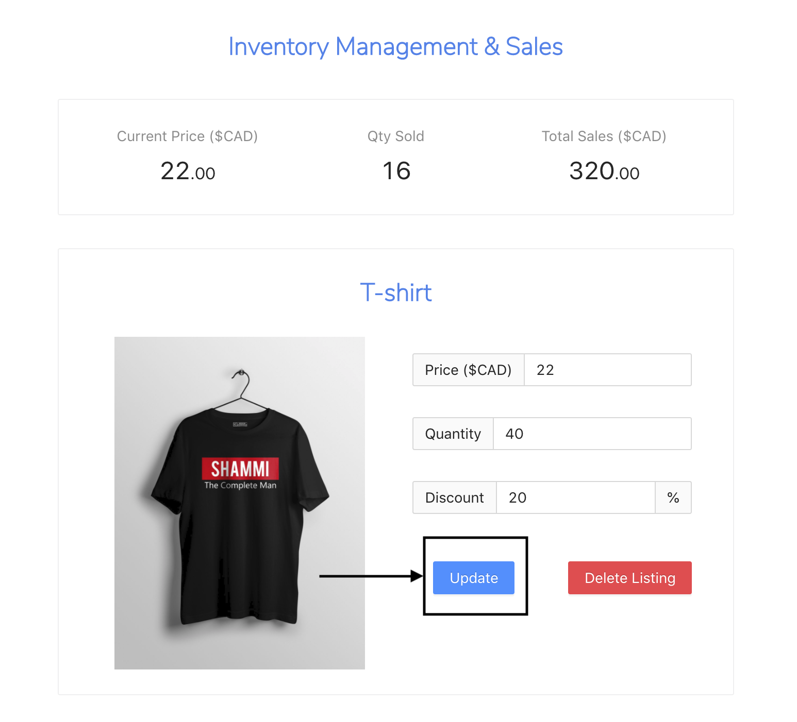

# Shopify-Dev-Challenge-Winter-2021

Inventory & Sales Manager
==============================

This is a three-fold project involving client-side features, RESTful APIs and Google Cloud integrations. The client-side has been developed in React.js and has been deployment manually into the Heroku hosting platform. The RESTful APIs are developed in Python Flask and containerized in Docker. The Inventory Store (APIs) are deployed to the Heroku platform through an automatic pipeline channel that runs with the help of Kubernetes engine. 



The entire application can be accessed here: https://shopify-winter-21.herokuapp.com/

# Table of Contents
- [Deployment](#deployment)
- [Schema](#schema)
- [API](#api)
    - [Inventory](#inventory)
        - [GET](#get-all-inventory)
        - [POST](#create-new-inventory)
        - [PUT](#edit-existing-inventory)
        - [DELETE](#delete-an-inventory)
    - [Sales](#sales)
        - [GET](#get-sales)
        - [POST](#update-sales)
- [Client](#client)
    - [Add-Inventory](#add-inventory)
    - [Delete-Inventory](#delete-inventory)
    - [Buy-Inventory](#buy-inventory)
    - [Edit-Inventory](#edit-inventory)


# Deployment
-----
I have deployed one instance of the flask pod with no LoadBalancers as I don't expect too much traffic. The Kubernetes engine has been managed by Google Cloud Engine Kubectl. 

# Schema 
-----
I have used Flask for creating the store and managing the RESTful API Services. The store contains two entities - Inventory and Sales. Inventory manages the general profile for the inventory and Sales manage the buying/selling points of the inventory. The entity diagram for the schema has been detailed below:


# API
-----
The APIs are hosted at https://shopify-backend-12121.herokuapp.com

## Inventory

### GET all Inventory
API to get all the inventories in the store

```GET /api/inventory```

Example Response:
```
{
    "code": 200,
    "data": [
        {
            "discount": "10",
            "image": "https://ii1.pepperfry.com/media/catalog/product/r/a/800x880/rajasthan-decor-multicolour-cotton-king-size-bedsheet---set-of-3-rajasthan-decor-multicolour-cotton--a2m4co.jpg",
            "inventory_id": "3b8dddaa-3ecb-461f-a27b-44a176bad5a7",
            "name": "Bedsheet",
            "price": "40",
            "qty": "29"
        },
        {
            "discount": "20",
            "image": "https://www.mydesignation.com/wp-content/uploads/2019/03/shammi-tshirt-image-unisex-mydesignation-.jpg",
            "inventory_id": "68db347a-d455-4ada-b6e7-6ec007dabcd3",
            "name": "T-shirt",
            "price": "22",
            "qty": "40"
        }
    ],
    "status": "success"
}
```

### Create New Inventory
API to create a new inventory

```POST /api/inventory

params:
{
    name: (Name of the Inventory) Required,
    image: (Image URL) Required,
    qty: (Quantity in Stock) Required,
    price: (Price) Required,
    discount: (Discount) Required,
}
```

### Edit Existing Inventory
API to edit an existing inventory

```PUT /api/inventory/:id

params:
{
    qty: (Quantity in Stock) Required,
    price: (Price) Required,
    discount: (Discount) Required,
}
```

### DELETE an Inventory
API to delete an inventory

```DELETE /api/inventory/:id```

### GET individual Inventory
API to get data for individual inventory

```GET /api/inventory/:id```

Example Response: 
```
{
    "code": 200,
    "data": {
        "discount": "20",
        "image": "https://www.mydesignation.com/wp-content/uploads/2019/03/shammi-tshirt-image-unisex-mydesignation-.jpg",
        "inventory_id": "68db347a-d455-4ada-b6e7-6ec007dabcd3",
        "name": "T-shirt",
        "price": "22",
        "qty": "40"
    },
    "status": "success"
}
```

# Client
-----
The Client consists of a simple React.js application that manages the buying/selling peices of the inventory along with the sales and stock management. The client uses React Hooks to navigate between different Components. I have also integrated the Ant-Design library to make the page look pretty and neat. 

## Add Inventory



## Buy Inventory



## Delete Inventory



## Edit Inventory

