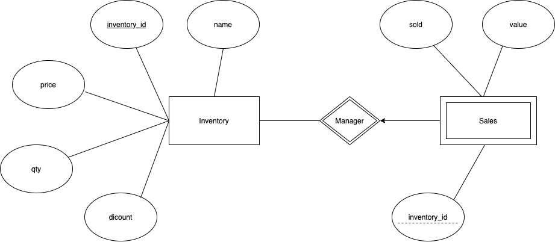

# Shopify-Dev-Challenge-Winter-2021

Inventory & Sales Manager
==============================

This is a three-fold project involving client-side features, RESTful APIs and Google Cloud integrations. The client-side has been developed in React.js and has been deployment manually into the Heroku hosting platform. The RESTful APIs are developed in Python Flask and containerized in Docker. The Inventory Store (APIs) are deployed to the Heroku platform through an automatic pipeline channel that runs with the help of Kubernetes engine. 

The entire application can be accessed here: https://shopify-winter-21.herokuapp.com/

# Table of Contents
- [Deployment](#deployment)
- [Schema](#schema)
- [Client](#client)
- [API](#api)
    - [Inventory](#inventory)
        - [GET](#get-all-inventory)
        - [POST](#create-new-inventory)
        - [PUT](#edit-existing-inventory)
        - [DELETE](#delete-an-inventory)
    - [Sales](#sales)
        - [GET](#get-sales)
        - [POST](#update-sales)

# Deployment
-----
I have deployed one instance of the flask pod with no LoadBalancers as I don't expect too much traffic. The Kubernetes engine has been managed by the GKE clusters. 

# Schema 
-----
I have used Flask for creating the store and managing the RESTful API Services. The store contains two entities - Inventory and Sales. Inventory manages the general profile for the inventory and Sales manage the buying/selling points of the inventory. The entity diagram for the schema has been detailed below:

